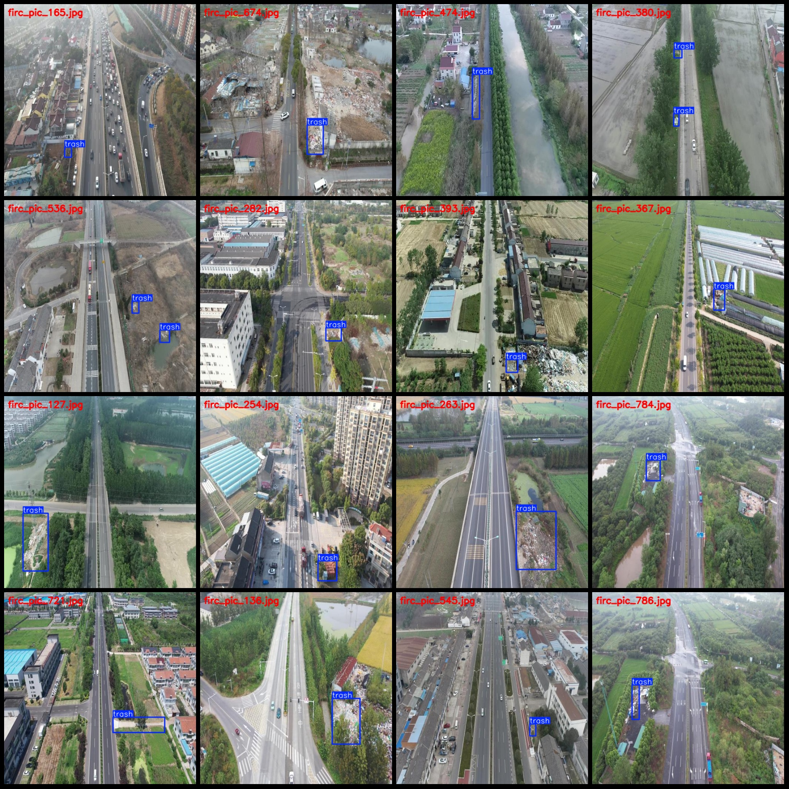
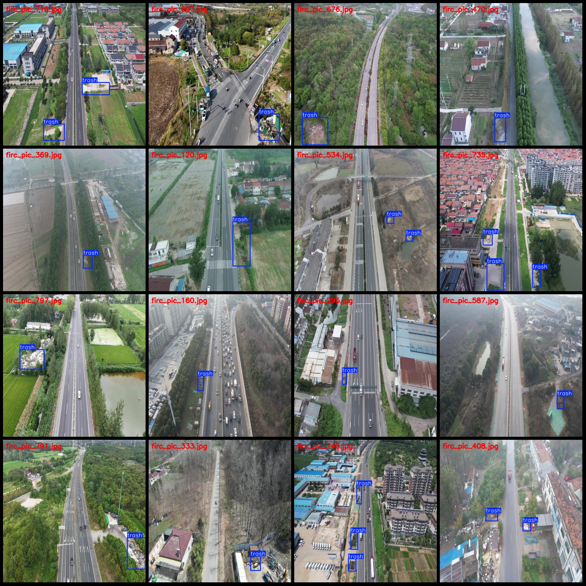

# Drone Perspective aerial photography dataset for trash detection in highway surroundings: VOC+YOLO format (799 images, 1 category)

Data format: Pascal VOC format + YOLO format (without split path txt files, only containing jpg images and corresponding VOC format xml files and yolo format txt files).
Number of images (jpg file count): 799
Number of annotations (xml file count): 799
Number of annotations (txt file count): 799
Number of annotation categories: 1
Annotation category name: "trash"
Number of bounding box per category: 934
Total number of bounding boxes: 934
Number of images each category occupies: 799
Image resolution: 512x512
Annotation tool used: labelImg
Annotation rules: draw rectangle boxes for categories
Important notes: The dataset does not have been divided into training, validation, or testing sets. Please divide them yourself.
Special statement: This dataset does not guarantee the accuracy of the trained model or weight files.
Image preview:
Annotation examples:

## Images

Here is a pay link on Stripe ( https://buy.stripe.com/3cs8yP7sY87d0vu9AB ). Please contact me lonlonago@foxmail.com after funding $89, and I will send you a complete data files , thank you!

